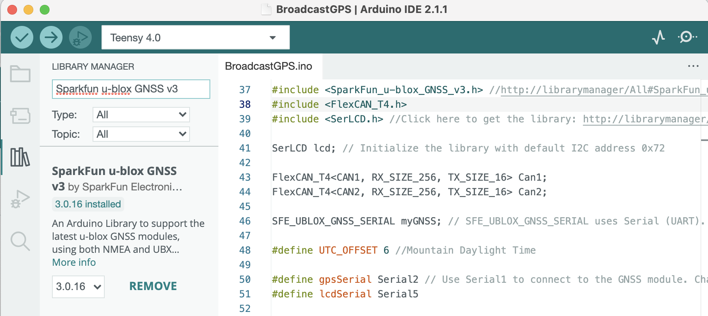
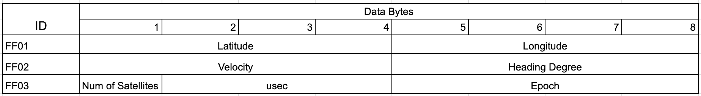

# TruckGPS
Arduino Sketch to format CAN data for collecting CAN and GPS data using a Teensy 4 and NEO-M9N from SparkFun.

## Upload Arduino Requirements and Tutorial
These steps will show how to install the Arduino IDE and install the required libraries.

1. Download and install the [Arduino 2.0.x IDE](https://www.arduino.cc/en/software) from Arduino's website.
1. Open the Arduino IDE and install [Teensyduino](https://www.pjrc.com/teensy/td_download.html) by following the steps on their website.
1. In the Arduino IDE application, click on the Library Manager on the left tab and search "Sparkfun u-blox GNSS v3" and install it.



4. In the same Library Manager tab, search and install "Sparkfun SerLCD Arduino Library".


5. Click the green checkmark at the top left to verify the code and check for any errors.
6. Click the right arrow at the top left to upload the code to the Arduino. Connect an antenna to it and it should search and find satellites. 
7. Connect a CANLogger3 and/or a TruckCape with the Arduino and it should broadcast GPS data and filter CAN msgs to only IDs that contain wheel-based vehicle speed and engine speed.

## Decoding the Data
After CAN data is logged, it can be decoded to get GPS information. GPS information is saved to the CAN data in IDs FF01, FF02, and FF03. FF01 is the position pgn, FF02 is considered the velocity pgn, and FF03 is the gps time pgn. 
Below is a table showing how to decode the bytes:


These can be decoded by hand or the python script called "CAN_GPS_Decoder.py" can be used. Below will show the various tasks it can perform.

```
python3 CAN_GPS_Decoder.py -h
```
This will simply display all of the possible arguments with descriptions of each argument.

```
python3 CAN_GPS_Decoder.py --plot filename
```
This will decode and plot both the vehicle speed and engine speed from the CAN data

```
python3 CAN_GPS_Decoder.py --plot-two-files filename1 filename2
```
This will decode and plot both the vehicle speed and engine speed from two CAN data files. This can be used to compare two CAN data files. It can also be used to make sure that a CAN binary and CAN text file of the same drive match up correctly.

```
python3 CAN_GPS_Decoder.py --show-gps-info filename
```
This will display basic information about the number of satellites present, the gps time, gps velocity, and heading degree while data was being logged.

## Generating a KML File
Additionally, the python script can be used to generate a kml file based on the data logged. To generate the kml file, run the command:
```
python3 CAN_GPS_Decoder.py --create-kml-file filename
```
This will create the kml file with all of the longitude and latitude values recorded during the logged drive. This can be uploaded to Google Earth and it will show each of the position points on a satellite map. 

The file will look similar to this:
```
<?xml version="1.0" encoding="UTF-8"?>
<kml xmlns="http://www.opengis.net/kml/2.2">
  <Document>
    <Placemark>
      <name>Location 1</name>
      <Point>
        <coordinates>-105.0767131,40.5921332,0</coordinates>
      </Point>
    </Placemark>
    <Placemark>
      <name>Location 2</name>
      <Point>
        <coordinates>-105.0767066,40.5921396,0</coordinates>
      </Point>
    </Placemark>
    <Placemark>
      <name>Location 3</name>
      <Point>
        <coordinates>-105.0767022,40.5921452,0</coordinates>
      </Point>
    </Placemark>
  </Document>
</kml>
```